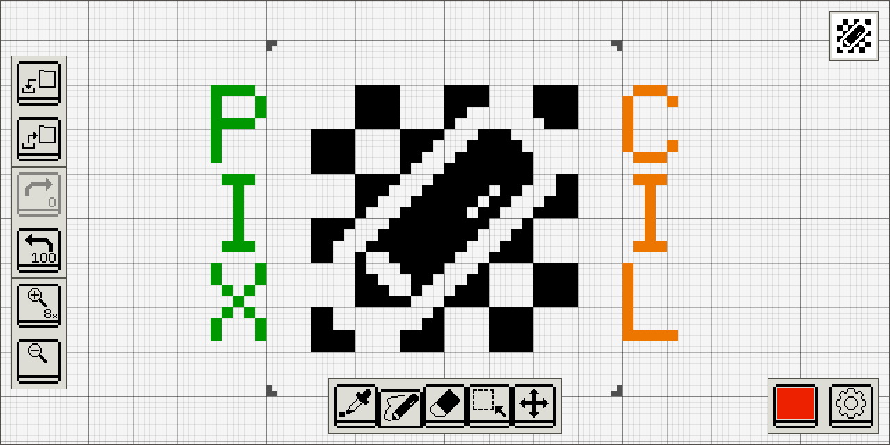

Pixcil
======

[](https://crates.io/crates/pixcil)
[](https://github.com/sile/pixcil/actions)


Simple pixel art editor with (almost) infinite canvas.

Online editors:
- [itch.io](https://reduls.itch.io/pixcil)
- [GitHub Pages](https://sile.github.io/pixcil) (PWA)
- [VSCode Extension](https://marketplace.visualstudio.com/items?itemName=sile.pixcil)



Features
--------

- Simple and intuitive UI
- (Almost) infinite canvas
  - The center frame region is exported as the final image
  - You can make use of the blank space as a temporary working buffer, color palette, etc
  - If settings are enabled, the continuous vertical frames are treated as layers and the successive horizontal frames are regarded as animation frames
- Support PNG file format
  - Created images are saved as PNG files (with additional metadata)
  - You can load existing PNG files and use Pixcil as a dot-by-dot PNG file editor

How to build
------------

### Web

You can use [Cargo](https://doc.rust-lang.org/cargo/) to build Pixcil.

```console
// Build.
$ git clone https://github.com/sile/pixcil.git
$ cd pixcil
$ cargo build --release --target wasm32-unknown-unknown
$ ls target/wasm32-unknown-unknown/release/pixcil.wasm

// Start an HTTP server and visit the root page in your browser.
$ cd web/
$ start-your-favorite-http-server
```

### Windows

```console
$ cargo run --release -p pixcil_windows
```
